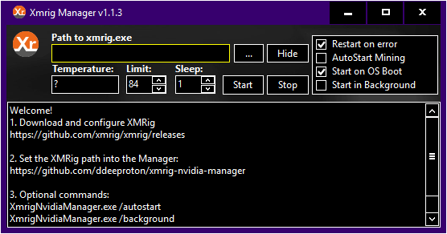

# Xmrig Nvidia Manager

### Download release:

https://github.com/ddeeproton/xmrig-nvidia-manager/tree/master/releases

### Download sources:

https://github.com/ddeeproton/xmrig-nvidia-manager/tree/master/sources

# Description: 

"Xmrig Manager" helps to avoid temperature exceeding on graphic card when using xmrig application. 

If the temperature exceeds limit, then mining is stopped for 2 minutes. 

Actually, this Manager is compatible with one graphic card only. If you mine with two or more graphic cards, you have to use one "XMRIG Manager"'s instance per graphic card (and stored in a different directory). 

# How to use?

1. Download and configure xmrig

2. Set the path of xmrig into "XMRIG Manager".

3. Press button Start in "XMRIG Manager".

# Download xmrig.exe (GPU and CPU Mining): 

https://github.com/xmrig/xmrig/releases

### Documentation and sources can be found here:

https://github.com/xmrig/xmrig

# How to Build? 

### From v1.0.6 until the most recent:

Download Lazarus for Windows and build it. 

http://www.lazarus-ide.org/index.php?page=downloads

### From oldest version until v1.0.5:

Download Delphi 7 for Windows and build it.

A free account must be created on developpez.com (French website)

https://delphi.developpez.com/telecharger-gratuit/delphi7-perso/

# Changes

### v1.1.3
	Display time before autorestart
	
	Fix the Setup.ini config
	
	Change design and text description on start

### v1.1.2
	Add option Restart on error
	
	Remove option No donation (deprecied on XRMIG > 5.0.0)
	
### v1.1.1
	Add compatibility for XMRig version 5.0.0 and above. 
	
	Add Sleep time input value into GUI
	
### v1.0.13
	Fix issue on restart (no compatible with 5.0.0 and above).
	
### v1.0.12
	Fix issue on restart

### v1.0.11
	Add more options
	
### v1.0.10
	Fix issue Win32
	
### v1.0.9
	Fix issue on design
	
	Fix issue on autostart

### v1.0.8
	Add autostart mining with application

### v1.0.7
	Fix issue on "no donation"
	
	Add Systray icon
	
### v1.0.6
	The project is compiled with Lazarus
	
	Add Checkbox "No Donation" (if mining is not profitable enough)
	
### v1.0.5
	Add messages to help customers

	New design

### v1.0.4
	Fix restarting message on stop or start click 
	
	New design

### v1.0.3
	Fix issue on stop or start button when a restarting is planned
	
### v1.0.2
	Fix issue on saving temperature limit
	
### v1.0.1
	Fix issue on restart mining

### v1.0.0 
	First commit

	