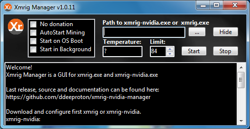

# Xmrig Nvidia Manager

### Download release:

https://github.com/ddeeproton/xmrig-nvidia-manager/tree/master/releases

### Download sources:

https://github.com/ddeeproton/xmrig-nvidia-manager/tree/master/sources

# Description: 

"Xmrig Nvidia Manager" helps to avoid temperature to exceed on graphic card when using xmrig-nvidia application

If the temperature exceeds limit, then mining will be stopped for 2 minutes. 

# How to Build?

Download Delphi 7 (for free) and build it.

A free account must be created on developpez.com

https://delphi.developpez.com/telecharger-gratuit/delphi7-perso/

# xmrig-nvidia.exe: 

### Last version can be downloaded here:

https://github.com/xmrig/xmrig-nvidia/releases

### Documentation and sources can be found here:

https://github.com/xmrig/xmrig-nvidia

# Changes

### v1.0.0 
	First commit
	
### v1.0.1
	Fix issue on restart mining
	
### v1.0.2
	Fix issue on saving temperature limit

### v1.0.3
	Fix issue on stop or start button when a restarting is planned