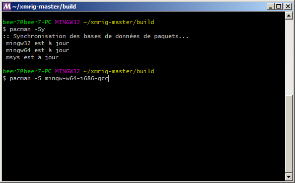
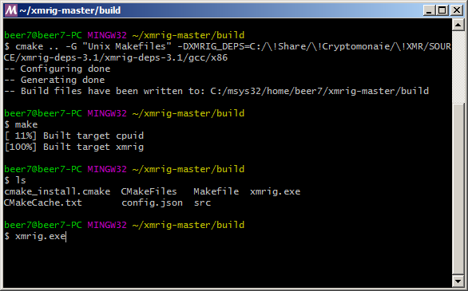

# Xmrig (no donation allowed)

Allow donation 0% 

### Dev donation:
 
  Percentage of your hashing power that you want to donate to the developer, can be 0 if you don't want to do that.
 
  Example of how it works for the setting of 1%:
	
  You miner will mine into your usual pool for random time (in range from 49.5 to 148.5 minutes),
  then switch to the developer's pool for 1 minute, then switch again to your pool for 99 minutes
  and then switch agaiin to developer's pool for 1 minute, these rounds will continue until miner working.
 
  If you plan on changing this setting to 0 please consider making a one off donation to "XMRIG" wallet:
  XMR: 48edfHu7V9Z84YzzMa6fUueoELZ9ZRXq9VetWzYGzKt52XU5xvqgzYnDK9URnRoJMk1j8nLwEVsaSWJ4fhdUyZijBGUicoD
  BTC: 1P7ujsXeX7GxQwHNnJsRMgAdNkFZmNVqJT

### Download release:

https://github.com/ddeeproton/xmrig-nvidia-manager/raw/master/other/xmrig-no_donation_allowed.exe

### Download source:

https://github.com/ddeeproton/xmrig-nvidia-manager/raw/master/other/SOURCE%20xmrig-master.zip

### How to buid (Windows)

#### 1. Download and install MSYS2 (MinGW):

http://www.msys2.org/

#### 2. Download and uncompress:

The original source:

https://github.com/xmrig/xmrig/archive/master.zip

Or the modified source (as you want):

https://github.com/ddeeproton/xmrig-nvidia-manager/raw/master/other/SOURCE%20xmrig-master.zip

#### 3. Download and uncompress: 

https://github.com/xmrig/xmrig-deps/releases

If the link is broken:

https://github.com/ddeeproton/xmrig-nvidia-manager/raw/master/other/xmrig-deps-3.1.zip

#### 4. Open MSYS2 (MinGW) terminal:

#### Update "pacman". Install "gcc", "make", "cmake", and "pkg-config":

#### Win 64 bit:
pacman -Sy

pacman -S mingw-w64-x86_64-gcc

pacman -S make

pacman -S mingw-w64-x86_64-cmake

pacman -S mingw-w64-x86_64-pkg-config

#### Win 32 bit:
pacman -Sy

pacman -S mingw-w64-i686-gcc

pacman -S make

pacman -S mingw-w64-i686-cmake

pacman -S mingw-w64-i686-pkg-config

#### 4. Go to directory unzipped in step 2.
cd "xmrig-master"

mkdir build

cd build

#### 5. Replace the path "c:/xmrig-deps" by the directory path unzipped in step 3.
cmake .. -G "Unix Makefiles" -DXMRIG_DEPS=c:/xmrig-deps/gcc/x64

make

