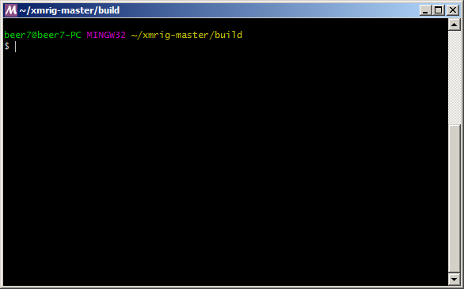

# Xmrig (no donation allowed)

### Download release:

https://github.com/ddeeproton/xmrig-nvidia-manager/raw/master/other/xmrig-no_donation_allowed.exe

### Download source:

https://github.com/ddeeproton/xmrig-nvidia-manager/raw/master/other/SOURCE%20xmrig-master.zip

### How to buid (Windows)

#### 1. Download and install MSYS2 (MinGW):

http://www.msys2.org/

#### 2. Download and uncompress:

#### 2.a. Download and uncompress the source:

The original source:

https://github.com/xmrig/xmrig/archive/master.zip

Or the modified source (as you want):

https://github.com/ddeeproton/xmrig-nvidia-manager/raw/master/other/SOURCE%20xmrig-master.zip

#### 2.b. Download and uncompress the dependencies: 

https://github.com/xmrig/xmrig-deps/releases

If the link is broken:

https://github.com/ddeeproton/xmrig-nvidia-manager/raw/master/other/xmrig-deps-3.1.zip

#### 3. Open MSYS2 (MinGW) terminal:

#### Update "pacman". Install "gcc", "make", "cmake", and "pkg-config":

#### Win 64 bit:
pacman -Sy

pacman -S mingw-w64-x86_64-gcc

pacman -S make

pacman -S mingw-w64-x86_64-cmake

pacman -S mingw-w64-x86_64-pkg-config

#### Win 32 bit:
pacman -Sy

pacman -S mingw-w64-i686-gcc

pacman -S make

pacman -S mingw-w64-i686-cmake

pacman -S mingw-w64-i686-pkg-config

#### 4. Go to directory unzipped in step 2.a.
cd "xmrig-master"

mkdir build

cd build

#### 5. Replace the path "c:/xmrig-deps" by the directory path unzipped in step 2.b.
cmake .. -G "Unix Makefiles" -DXMRIG_DEPS=c:/xmrig-deps/gcc/x64

make

